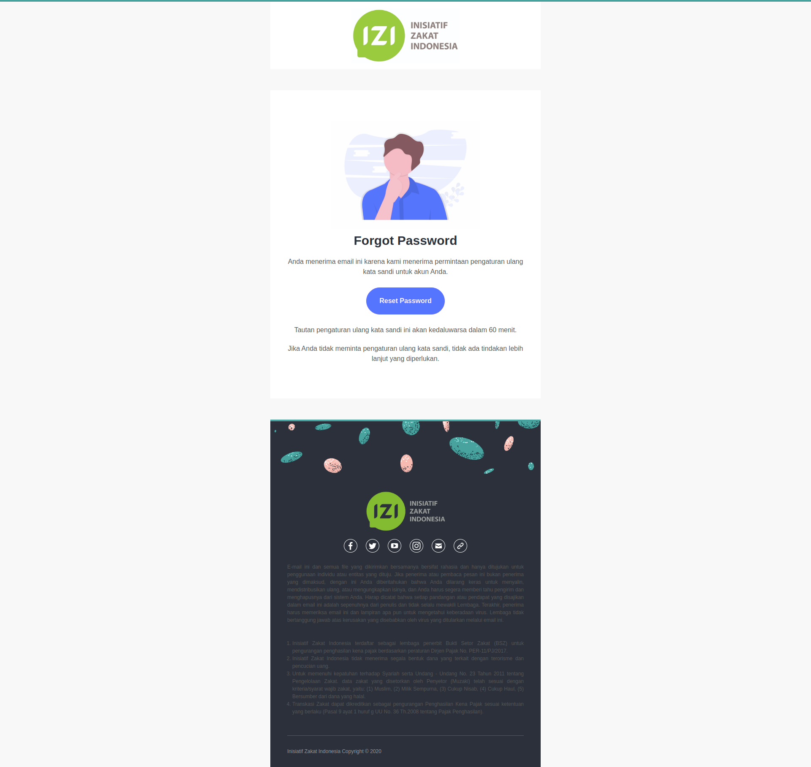

# Template Packages

Package ini digunakan sebagai template Laravel blade. Untuk sementara ini hanya
untuk email.

## Install

```bash
composer require inisiatif/package-template
```

Register service provider pada `config/app.php` untuk Laravel, sedangkan untuk Lumen tambahkan ini 
di file `bootstrap/app.php` :

```php
<?php

use Inisiatif\Package\Template\InisiatifTemplateServiceProvider;

// Code lainnya disini

$app->register(InisiatifTemplateServiceProvider::class);
```

## Usage

Contoh penggunaan untuk pembuatan email

```blade
@extends('inisiatif::mail.layouts.app')

@section('content')
    @component('inisiatif::mail.components.image')
        https://inisiatif-assets.imgix.net/undraw_forgot_password.png
    @endcomponent

    @component('inisiatif::mail.components.title')
        Forgot Password
    @endcomponent

    @component('inisiatif::mail.components.paragraph', ['align' => 'center'])
        Anda menerima email ini karena kami menerima permintaan pengaturan ulang kata sandi untuk akun Anda.
    @endcomponent

    @component('inisiatif::mail.components.button', ['url' => 'https://localhost/password/reset'])
        Reset Password
    @endcomponent

    @component('inisiatif::mail.components.paragraph', ['align' => 'center'])
        Tautan pengaturan ulang kata sandi ini akan kedaluwarsa dalam {{ \Inisiatif\Backend\Account\Application\Security\PasswordBrokerManager::TOKEN_EXPIRED }} menit.
    @endcomponent

    @component('inisiatif::mail.components.paragraph', ['align' => 'center'])
        Jika Anda tidak meminta pengaturan ulang kata sandi, tidak ada tindakan lebih lanjut yang diperlukan.
    @endcomponent
@endsection
```
Tampilan


